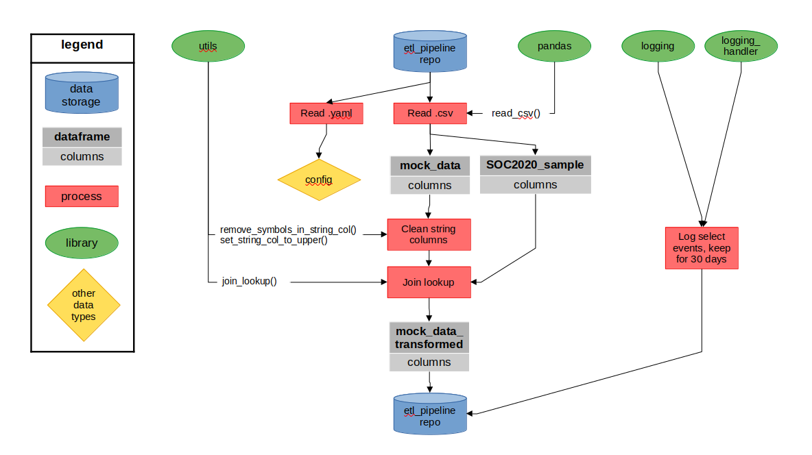

# etl_pipeline

A basic ETL pipeline built for UKHSA Data Engineer application, July 2024.

----------

## Desk instructions

### Set up

1. Ensure Python version 3.8 or above is installed.
2. If your IDE requires it, create and activate a virtual environment.
3. Run the following code in the terminal to install dependencies:
   - Linux: `pip install .`
   - Windows: `py -m pip install .`

## Run

1. Check the config file at `etl_pipeline/input/config.yaml` and update as necessary.
   As default, it is set up to run on the `mock_data.csv` in
   `etl_pipeline/input/`.
2. Run the following code in the terminal to run the pipeline:
   - Linux: `python run.py`
   - Windows: `py run.py`

----------

## Pipeline flowchart

----------

## Developer instructions

### Set up

1. Ensure Python version 3.8 or above is installed.
2. If your IDE requires it, create and activate a virtual environment.
3. Run the following code in the terminal to install dependencies:
   - Linux: `pip install  .[dev]`
   - Windows: `py -m pip install  .[dev]`
4. Run the following code in the terminal to install project pre-commits:
   - `pre-commit install`

----------

## Input data

- `mock_data`: manually created
- `soc_2020_sample`: derived from the Standard Occupational Classification 2020 coding index in the `SOC2020_coding_index_22-02-24.csv` file downloaded from the Office for National Statistics [here](https://www.ons.gov.uk/methodology/classificationsandstandards/standardoccupationalclassificationsoc/soc2020/soc2020volume2codingrulesandconventions).
